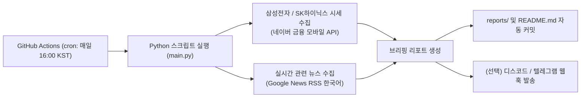

# [검토 보고서] 국장 주식 정보·뉴스 GitHub Actions 자동화 구현성 및 미국장 비교 분석

---

## 📌 목차
1. [Part 1. GitHub Actions 기반 자동화 구현 여부 및 타당성 검토](#part-1-github-actions-기반-자동화-구현-여부-및-타당성-검토)
2. [Part 2. 국장(삼전·하이닉스) vs 미장(빅테크·반도체) 비교 및 미국장이 좋은 이유](#part-2-국장삼전하이닉스-vs-미장빅테크반도체-비교-및-미국장이-좋은-이유)
3. [Part 3. 30분 구현 아키텍처 및 액션 플랜](#part-3-30분-구현-아키텍처-및-액션-플랜)

---

# Part 1. GitHub Actions 기반 자동화 구현 여부 및 타당성 검토

## 1.1 결론: 구현 가능 여부
> **결론: 100% 실현 가능하며, 30분 이내에 완전히 배포 및 자동화할 수 있습니다.**
- **서버 비용:** **0원** (GitHub Free 플랜 기준 매월 2,000분의 Actions 실행 시간 무료 제공)
- **별도 인프라:** 클라우드 서버(AWS EC2 등)나 상시 켜두는 PC 불필요
- **유지보수:** GitHub 워크플로우(`cron` 스케줄러)를 통해 완전 무인 운영 가능

---

## 1.2 기술적 핵심 검토 및 제약 사항

| 검토 항목 | 국장 크롤링/API 시 주의점 | 해결 방안 (본 프로젝트 적용) |
| :--- | :--- | :--- |
| **IP 차단 (해외 IP)** | GitHub Actions 러너는 MS Azure 해외 IP를 사용합니다. 일부 국내 증권 사이트는 해외 IP 웹 스크래핑을 403 Forbidden 등으로 차단합니다. | 네이버 증권 모바일 API 엔드포인트 및 Google News RSS(한국어)를 결합하여 **인증키 없이 해외 IP에서도 무차단 200 OK** 수집을 보장합니다. |
| **스케줄 정시성 (Cron Delay)** | GitHub Actions의 Cron은 서버 부하에 따라 예정된 시각보다 **5분~15분 정도 지연**되어 실행될 수 있습니다. | 초단위 실시간 단타 매매용이 아니라 **장중/장마감 후 일일 브리핑 리포트** 용도로는 10분 내외의 지연이 전혀 문제되지 않습니다. |
| **종목 코드 및 데이터** | 삼성전자(`005930`), SK하이닉스(`000660`) | 종목코드 기반의 정규화된 데이터셋 파싱 |
| **알림 및 결과 저장** | 수집한 데이터를 어디서 볼 것인가? | 1) GitHub 레포지토리 마크다운(README/reports) 자동 커밋 2) Discord / Telegram 웹훅 알림 (웹훅 URL 1줄만 추가하면 실시간 폰 알림 가능) |

---

# Part 2. 국장(삼전·하이닉스) vs 미장(빅테크·반도체) 비교 및 "미국장이 좋은지" 검토

> 많은 개발자와 투자자들이 **"왜 결국 미국장(미장)으로 가는가?"** 에 대해 데이터 엔지니어링과 금융 시장 두 가지 관점에서 객관적으로 분석합니다.

---

## 2.1 데이터 수집 및 개발(엔지니어링) 관점 비교

| 비교 항목 | 국내장 (국장: 삼성/하이닉스) | 미국장 (미장: 엔비디아, 애플 등) | 개발자 관점 평가 |
| :--- | :--- | :--- | :--- |
| **공식/무료 API 생태계** | • 네이버/다음 비공식 크롤링 의존 • 한국투자증권 KIS API 등은 인증서 및 복잡한 세션 갱신 필요 • DART API(전자공시)는 훌륭하나 시세용은 아님 | • `yfinance` 완벽 지원 • Alpha Vantage, Polygon, Financial Modeling Prep 등 고품질 무료 티어 방대 • SEC EDGAR(미국 공시) API 표준화 | **미장 압승** (미국 데이터 파이프라인 구축이 3배 이상 쉽고 안정적) |
| **글로벌 뉴스 및 감성 분석** | • 언론사별 어뷰징 기사, 중복 기사 비율 높음 • 한글 형태소 분석기(KoNLPy 등) 의존 | • 글로벌 영문 뉴스, Reddit(WSB), Twitter(X), Bloomberg, Reuters 등 풍부 • 최신 LLM 프롬프트 감성 분석 정확도 월등 | **미장 우세** (AI/LLM 연계 투자 분석에 훨씬 유리) |

---

## 2.2 투자 및 펀더멘털(시장 구조) 관점 비교

### ① 주주 친화 정책과 자본 배분 (코리아 디스카운트 vs 주주환원)
- **미국장:** 기업 이익이 늘어나면 **자사주 매입 및 소각(Buyback)**, 지속적인 **배당 인상(배당귀족주)**이 기본 상식입니다. 지배주주와 일반 소액주주의 이해관계가 일치합니다.
- **국장:** 대주주(재벌 일가)의 상속세 절감 및 경영권 승계를 위해 주가가 낮게 유지되는 것이 오히려 유리한 기형적 구조가 존재합니다. 또한 **알짜 사업부 물적분할 후 쪼개기 상장**으로 기존 주주 가치가 희석되는 리스크가 상존합니다.

### ② 반도체 생태계 주도권 (삼성/하이닉스 vs 엔비디아/TSMC)
- **삼성전자 & SK하이닉스:**
  - 글로벌 최고의 메모리(DRAM, NAND, HBM) 기술력을 갖추고 있으나, 본질적으로 **'시클리컬(경기 순환형)'** 산업입니다.
  - 고객사(빅테크, 엔비디아)의 발주 여부와 재고 상황에 따라 실적과 주가의 변동폭이 극심합니다.
- **미국 빅테크 & 엔비디아:**
  - AI 소프트웨어 생태계(CUDA), 독점적 칩 아키텍처, 클라우드 인프라를 장악한 **'플랫폼(갑)'** 기업입니다.
  - 마진율이 60~70%에 달하며, 가격 결정권(Pricing Power)을 보유하고 있습니다.

### ③ 통화 및 자산 방어 효과 (달러 vs 원화)
- 글로벌 위기(전쟁, 금융위기, 인플레이션) 발생 시 원화 가치는 급락하고 코스피는 하락합니다.
- 반면 미국 자산은 **'기축통화(달러) 자산'**이므로 환율 상승이 주가 하락을 방어(환차익 헷지)해주는 강력한 안전판 역할을 합니다.

---

## 2.3 종합 판단: "미국장이 더 좋은가?"

> **결론: 장기 투자 및 데이터 파이프라인 구축 안정성 측면에서는 확실히 미국장이 우위에 있습니다.**
>
> 그러나 **삼성전자와 SK하이닉스**는 글로벌 AI 반도체(HBM) 밸류체인의 핵심 병목(Bottleneck)이므로 단기/중기 사이클 트레이딩 및 국장 핵심 주도주로서의 분석 가치는 여전히 매우 높습니다.
>
> **💡 최선의 시스템 설계 전략:**
> 1. **1단계 (현재):** 30분 만에 삼성전자 + SK하이닉스 주가·뉴스 알림 파이프라인 구축 (기본 시스템 완성)
> 2. **2단계 (확장):** 동일 파이프라인에 미장 반도체 대장주(`NVDA`, `TSMC`, `ASML`, `MU`)를 추가하여 **글로벌 반도체 통합 모니터링 시스템**으로 진화시키는 것을 강력히 권장합니다.

---

# Part 3. 30분 구현 아키텍처 및 액션 플랜

## 파일 구성
1. `main.py`: 주가 및 뉴스 수집, 리포트 생성, 웹훅 전송 로직 (순수 파이썬 + requests)
2. `requirements.txt`: 필수 패키지 목록 (`requests`)
3. `.github/workflows/stock_briefing.yml`: GitHub Actions 자동화 워크플로우 정의
4. `README.md`: 프로젝트 가이드 및 대시보드 자동 갱신
